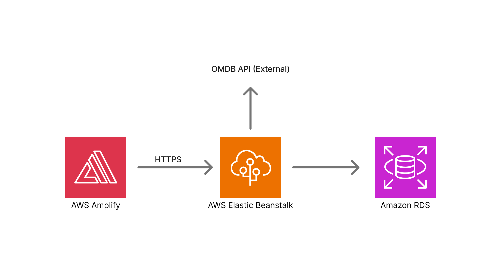

# 🎬 Movie Watchlist

Moderni full stack -web-sovellus elokuvien etsimiseen ja oman katsottujen elokuvien listan hallintaan.
Sovellus on rakennettu ja deployattu tuotantovalmiina AWS-ympäristöön.

## 🔗 Live-sovellus: https://movie-watchlist.com

Sovellusta voi testata ilman rekisteröitymistä seuraavilla tunnuksilla:

**Email:** demo@movie-watchlist.com  
**Password:** demopassword123

Demo-käyttäjä on tarkoitettu vain sovelluksen testaamiseen.

## 📌 Mikä tämä projekti on?

Movie Watchlist on henkilökohtainen elokuvasovellus, jossa käyttäjä voi:

etsiä elokuvia ulkoisesta rajapinnasta

tarkastella elokuvien lisätietoja

luoda oman katsottujen elokuvien listan

kirjautua sisään ja käyttää sovellusta omalla tilillään

Projekti on tehty oppimis- ja portfolio­tarkoituksessa, mutta se noudattaa oikeita tuotantokäytäntöjä.

## ✨ Ominaisuudet

- 🔐 Rekisteröityminen ja kirjautuminen

- 🎬 Elokuvien haku OMDB API:n kautta

- 📄 Elokuvien lisätiedot modaalissa

- ⭐ Katsottujen elokuvien lista

- 🔒 Suojatut reitit kirjautuneille käyttäjille

- 🔔 Toast-ilmoitukset käyttäjälle

- 📱 Responsiivinen käyttöliittymä

## 🧱 Teknologiat

### Frontend

- React (Vite)

- React Router

- Tailwind CSS

- Hostattu AWS Amplifyssä

- Custom domain + HTTPS

### Backend

- Node.js

- Express

- JWT-autentikointi

- Hostattu AWS Elastic Beanstalkissa

- Load Balancer + health check

### Tietokanta

- PostgreSQL

- AWS RDS

- Eri tietokannat kehitykselle ja tuotannolle

## Arkkitehtuuri

Frontend (Amplify) ja backend (Elastic Beanstalk) deployataan erikseen

Ympäristömuuttujat eriytetty (dev / prod)

HTTPS koko sovelluksessa (ACM + Route 53)

Load Balancer ja health checkit

### Arkkitehtuurikaavio

## 📚 Mitä opin projektia tehdessä

Full stack -sovelluksen suunnittelu ja toteutus

Autentikointi ja suojatut reitit

Frontendin ja backendin erillinen deploy

AWS-palveluiden käyttö:

Amplify

Elastic Beanstalk

RDS

Route 53

ACM (HTTPS)

CORS-konfiguraatio tuotantoympäristössä

Oikeiden tuotanto-ongelmien debuggaus (SSL, health checkit, load balancer)

## 🚧 Mahdollisia jatkokehitysideoita

Elokuvien luokittelu / tagit

Käyttäjäprofiilisivu

Testaus (unit / e2e)

Pienet UI/UX-parannukset
